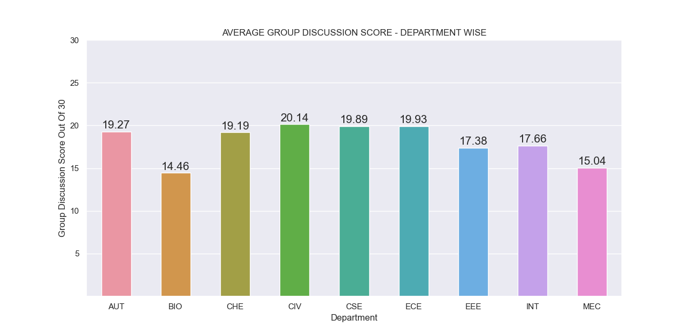
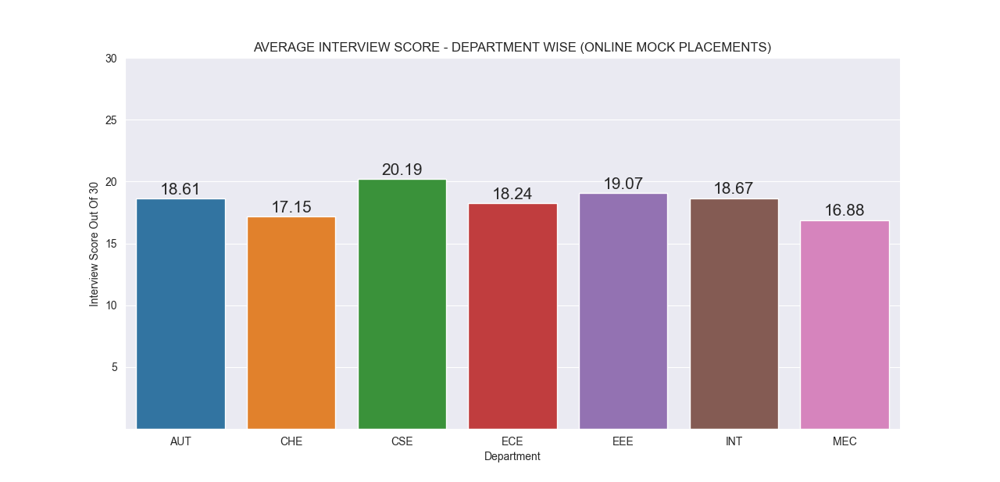
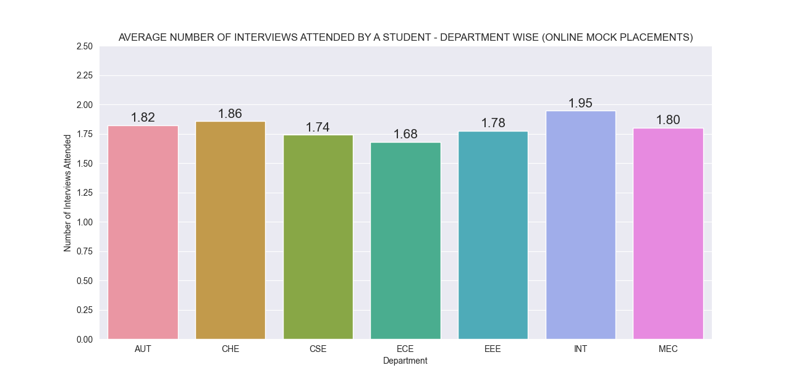

# MocksAnalysis

This is the Git repository for analyzing student performance and HR participation in __MOCK PLACEMENTS (2021)__.

MOCK PLACEMENTS was held in both online and offline modes this year and saw a particpation of __600+ students__ and __100+ Human Resource Managers__.

We are deeply greatful to everyone who helped make this event a grand success.

This repo contains the code and all necessary files which will give us insights into the scale at which this event was conducted.

To setup this repository, __fork the repository to your GitHub account.__
```
# Clone the repo to your local desktop
git clone https://github.com/<YOUR_GITHUB_USERNAME>/MocksAnalysis

# Navigate to the cloned repository
cd MocksAnalysis/
```

Windows Setup
```
# Setup Python virtual environment
python -m venv env

# Activate the virtual environment
source env/Scripts/activate
```

Linux/MacOS Setup
```
# Setup Python virtual environment
virtualenv env

# Activate the virtual environment
source env/bin/activate
```
 
```
# Install all dependencies
pip install -r requirements.txt

# Run the Script
python main.py
```

```
“UserWarning: Matplotlib is currently using agg, which is a non-GUI backend, so cannot show the figure.” when plotting figure with pyplot on Pycharm
If you see the above error on Linux or MacOS, run the following command,
sudo apt-get install python3-tk (Do not install it with pip or directly in the virtual environment)
```

## Graphs
* Average Score Given by Each HR on 20/02/2021.
* Average Score Given by Each HR on 21/02/2021.
* Number of Students Interviewed by Each HR - 20/02/2021
* Number of Students Interviewer by Each HR - 21/02/2021

## Visualizations
| __Average Aptitude Score By Department__                 | __Average Group Discussion Score By Department__                 |
| -------------------------------------------------------- | ---------------------------------------------------------------- |
|  |  |

| __Average Interview Score By Department__                 | __Average Number Of Interviews Attended By Department__      |
| --------------------------------------------------------- | ------------------------------------------------------------ |     
|  |  |

## Requirements
* Git (Download from [here])(https://git-scm.com/downloads)
* Python 3.7 (Download from [here](https://www.python.org/downloads/release/python-376/))
* virtualenv (Install it using `pip install virtualenv`)

## Libraries 
* `Pandas` for Data Exploration and Data Cleaning
* `Matplotlib` and `Seaborn` for Data Visualization

## Contributing
* __Please do not edit the mocks.csv file. Infact, do not even bother opening it.__

* Periodically pull changes from the upstream repository
```
# Set upstream to the main repo
git remote add upstream https://github.com/ForeseTech/MocksAnalysis

# Fetch changes from the repo
git fetch upstream

# Merge changes from main repo to your forked repo
git merge upstream/master
```

* After you have completed the task assigned to you, commit your changes to your local repo and open a pull request for the same. You should be making changes only to one file, that is `main.py`.
```
# Make sure your remotes are set correctly
git remote -v

Output:-
origin   - https://github.com/<YOUR_GITHUB_USERNAME>/MocksAnalysis 
upstream - https://github.com/ForeseTech/MocksAnalysis

# If you have installed any other dependencies other than the ones already present,
pip freeze > requirements.txt

# Add your files to the staging area
git add <file_name>

# Write a meaningful commit message
git commit -m "<COMMIT MESSAGE>"

# Push changes to your remote
git push origin master
```

* Please make sure your write meaningful comments for the code you write.
* Open a Pull Request from your fork's `master` branch to the main repo's `master` branch.
* Incase you don't know how to open a pull request, checkout this [link](https://docs.github.com/en/github/collaborating-with-issues-and-pull-requests/creating-a-pull-request-from-a-fork).

## Contributors
* Nilesh D
* Adhihariharan A U
* Allen Manoj
* Nikhilesh
* Poonam
